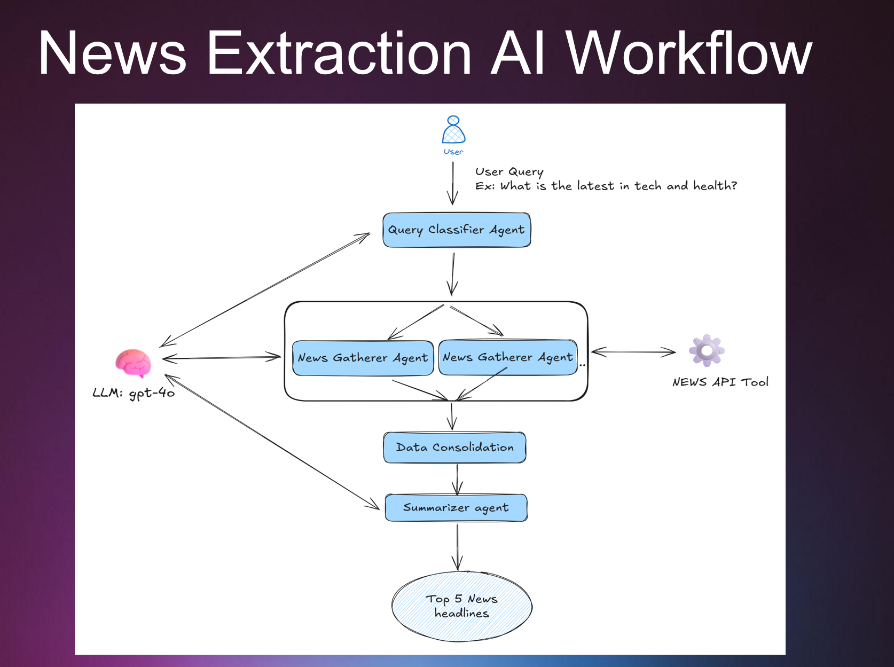
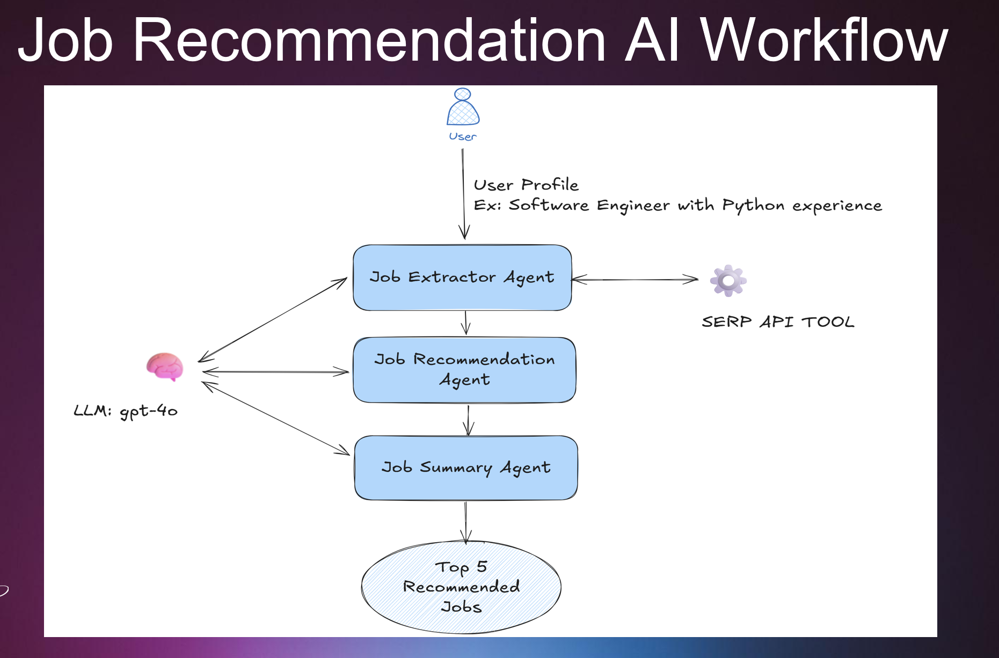

# AgentsToAllies

### Topic: 6044:
From Agents to Allies: Empowering Technologists with Multi-Agent AI Workflows

### Abstract: 
This session is built for technologists who want to understand how multi-agent systems work, build them from the ground up, and be part of the rapidly growing ecosystem shaping their future. Instead of abstract concepts, we'll explore this shift through real-time demos and an honest, practical look at the tools and frameworks available today.

## 🎯 Workshop Workflows

In this workshop, we'll build and explore two complete multi-agent AI workflows that demonstrate real-world applications:

### 📰 News Extraction AI Workflow
We'll create a news extraction workflow where multiple AI agents and processes run to identify categories from user query and summarize the news with top 5 headlines. 



### 💼 Job Recommendation AI Workflow  
We'll build a job recommendation AI worflow that helps users find relevant career opportunities:



**🚀 What You'll Learn:**
- How to design multi-agent architectures
- Practical implementation using Microsoft Agent Framework
- Real API integrations (SerpAPI, NewsAPI, Azure OpenAI)

---

## 🐙 GitHub Account Creation

Before starting the workshop, you'll need a GitHub account to access the repository and optionally use GitHub Codespaces.

### Create a GitHub Account:

1. **Visit GitHub**: Go to [https://github.com](https://github.com)
2. **Sign Up**: Click the **"Sign up"** button in the top right corner
3. **Create Account**:
   - Enter your **email address**
   - Create a **password** (use a strong password)
   - Choose a **username** (this will be your GitHub handle)
   - Verify you're human (complete the puzzle/captcha)
4. **Verify Email**: 
   - Check your email for a verification code
   - Enter the code on GitHub to verify your account
5. **Choose Plan**: Select **"Free"** (perfect for this workshop)
6. **Complete Setup**: Answer the optional questions about your coding experience

---

## 🚀 Setup

Choose your development environment:

<details>
<summary><b>💻 Option 1: Local Machine Setup</b> (Windows/Mac/Linux)</summary>

### 1. Install/Use an IDE of your choice
We are using Visual Studio Code.
- Visual Studio Code: https://code.visualstudio.com/download

### 2. Clone the Repository
```bash
git clone https://github.com/sindu2296/AgentsToAllies.git
cd AgentsToAllies
```

### 3. Download and Install Python 3.13.9
Download from: https://www.python.org/downloads/

Verify installation:
```bash
python --version
# Should output: Python 3.13.9
```

### 4. Create and activate a Python virtual environment

**Windows (PowerShell):**
```powershell
# Create virtual environment
python -m venv env

# Activate virtual environment
.\env\Scripts\Activate.ps1

# If you get execution policy error, run:
Set-ExecutionPolicy -ExecutionPolicy RemoteSigned -Scope CurrentUser
```

**Unix/MacOS:**
```bash
# Create virtual environment
python -m venv env

# Activate virtual environment
source env/bin/activate
```

### 5. Install dependencies
```bash
pip install -r requirements.txt
```

</details>

<details>
<summary><b>☁️ Option 2: GitHub Codespaces Setup</b> (Cloud-based)</summary>

### 1. Create a Codespace

**Option A: From GitHub Repository**
1. Navigate to [https://github.com/sindu2296/AgentsToAllies](https://github.com/sindu2296/AgentsToAllies)
2. Click the **Code** button (green button)
3. Select the **Codespaces** tab
4. Click **Create codespace on main**

**Option B: From GitHub Codespaces Dashboard**
1. Go to [https://github.com/codespaces](https://github.com/codespaces)
2. Click **New codespace**
3. Select repository: `sindu2296/AgentsToAllies`
4. Select branch: `main`
5. Click **Create codespace**

### 2. Wait for Automatic Environment Setup
The Codespace will automatically:
- ✅ Pull the repository code
- ✅ Install Python 3.13.9
- ✅ Install all dependencies from `requirements.txt`
- ✅ Install all required VS Code extensions
- ✅ Configure port forwarding for applications (e.g., Streamlit on port 8501)

**This takes 2-5 minutes on first creation.**

### 3. Verify Setup
Once the Codespace loads, verify you're in the correct location:
```bash
pwd
# Should show: /workspaces/AgentsToAllies
```

**Note:** No virtual environment or manual dependency installation needed! The Codespace container provides complete isolation, and all dependencies are automatically installed via the DevContainer configuration.

</details>

---

### Common Setup Steps (Required for Both Options)

Once you've completed either Option 1 or Option 2 above, follow these steps:

#### 1. Create .env file at the root folder
Create a `.env` file in the root directory with the following content:

**For Local Machine Setup:**
```env
AZURE_OPENAI_API_KEY="<your_openai_key>"
AZURE_OPENAI_ENDPOINT="<your_azure_openai_endpoint>"
MODEL_NAME="<model_name>"
NEWSAPI_API_KEY="<news_api_key>"
SERPAPI_API_KEY="<your_serp_api>"
```

**For GitHub Codespaces:**
```env
NEWSAPI_API_KEY="<news_api_key>"
SERPAPI_API_KEY="<your_serp_api>"
```

> **Note:** When using GitHub Codespaces, `AZURE_OPENAI_API_KEY`, `AZURE_OPENAI_ENDPOINT`, and `MODEL_NAME` are already configured as repository secrets. You only need to add the NewsAPI and SerpAPI keys.

> **Want to use your own Azure OpenAI credentials in Codespaces?** You can override the repository secrets by:
> 1. Adding your Azure OpenAI variables to the `.env` file
> 2. Updating the config files to use `load_dotenv(override=True)` instead of `load_dotenv()`

#### 2. Get API Keys

**Azure OpenAI credentials**: 
Refer to [AZURE_AIFOUNDRY_SETUP.md](./AZURE_AIFOUNDRY_SETUP.md) for step-by-step instructions on how to set up Azure AI Foundry and get your API key and endpoint values.

**SERPAPI_API_KEY:**  
Sign up at https://serpapi.com/. Register with email and phone number to receive a unique API key.
Update the SERPAPI_API_KEY in the .env file with the key obtained.

**NEWSAPI_API_KEY:**  
Get from https://newsapi.org/. Register with email and password to get the API key.
Update the NEWSAPI_API_KEY in the .env file with the key obtained.

---

## Sample Projects

### 1. Azure OpenAI Chat Sample
A basic example showing how to use Azure OpenAI chat completions API. Found in `AIFoundry_sample.py`.

### 2. Agent Framework Sample
Located in `AgentFramework_sample.py`, this demonstrates how to:
- Create and use Agent Framework agents with Azure OpenAI
- Build simple agent-based solutions
- Handle agent responses and execution

### 3. News Processing with Multiple Agents
Located in the `news` and `news_maf` folders, these samples show **two different frameworks** for building the same multi-agent news system:

#### Semantic Kernel Implementation (`news/`)
- Basic: Simple sequential processing with one agent
- Sequential: Multiple agents working one after another
- Concurrent: Parallel processing with `ConcurrentOrchestration`
- Uses: Kernel, plugins, `@kernel_function`, `FunctionChoiceBehavior.Auto()`

#### Microsoft Agent Framework Implementation (`news_maf/`)
- Sequential: Multiple agents working one after another
- Concurrent: Parallel processing with `ConcurrentBuilder`
- Uses: `ChatAgent`, function tools, simpler setup
- Run with:
  ```
  cd news_maf
  streamlit run app.py
  ```

Both implementations provide the same functionality but with different patterns and abstractions.


### 4. Job Recommendation with Multi Agents
Located in the `job_recommendation` and `job_recommendation_maf` folders, these samples show different approaches to job recommendation using multiple agents:

#### Semantic Kernel Implementation (`job_recommendation/`)
- Sequential: Multiple agents working one after another (extract, recommend, summarize)

#### Microsoft Agent Framework Implementation (`job_recommendation_maf/`)
- Sequential: Multiple agents working one after another (extract, recommend, summarize)
- Uses: `ChatAgent`, SerpAPI integration
- Run with:
  ```
  cd job_recommendation_maf
  streamlit run app.py
  ```

Agents use SerpAPI to fetch jobs, recommend relevant ones, and summarize results.

Please refer to README file in the respective folders for more details.

---

## 🧹 Post-Workshop Cleanup

After completing the workshop, it's important to clean up your resources to avoid unnecessary costs and maintain security. Follow these steps:

### 1. 🗂️ Codespace Cleanup (if using GitHub Codespaces)

**Stop your Codespace:**
1. Go to [https://github.com/codespaces](https://github.com/codespaces)
2. Find your `AgentsToAllies` codespace
3. Click the **⋯** (three dots) menu
4. Select **Stop codespace**

**Delete your Codespace (optional):**
1. Go to [https://github.com/codespaces](https://github.com/codespaces)
2. Find your `AgentsToAllies` codespace
3. Click the **⋯** (three dots) menu
4. Select **Delete**
5. Confirm deletion

> **Why delete?** While stopped Codespaces don't consume compute hours, deleting frees up your Codespace storage quota and keeps your dashboard clean. You can always recreate it later if needed.

### 2. 🔑 API Key Security

**Remove or Rotate API Keys:**

**For SERPAPI:**
1. Go to [https://serpapi.com/manage-api-key](https://serpapi.com/manage-api-key)
2. Either delete the API key or generate a new one

**For NewsAPI:**
1. Go to [https://newsapi.org/account](https://newsapi.org/account)
2. Either delete the API key or generate a new one

**For Azure OpenAI:**
1. Go to [Azure Portal](https://portal.azure.com)
2. Navigate to your Azure AI Foundry resource
3. Go to **Keys and Endpoint** section
4. Click **Regenerate** for both Key 1 and Key 2

### 3. 📊 Check Usage & Billing

**Azure:**
1. Visit [Azure Cost Management](https://portal.azure.com/#view/Microsoft_Azure_CostManagement/Menu/~/Overview)
2. Review your spending for AI services

**SERPAPI:**
1. Check your usage at [https://serpapi.com/dashboard](https://serpapi.com/dashboard)

**NewsAPI:**
1. Review usage at [https://newsapi.org/account](https://newsapi.org/account)

> **💡 Tip:** Set up billing alerts in Azure to avoid unexpected charges in future projects!
